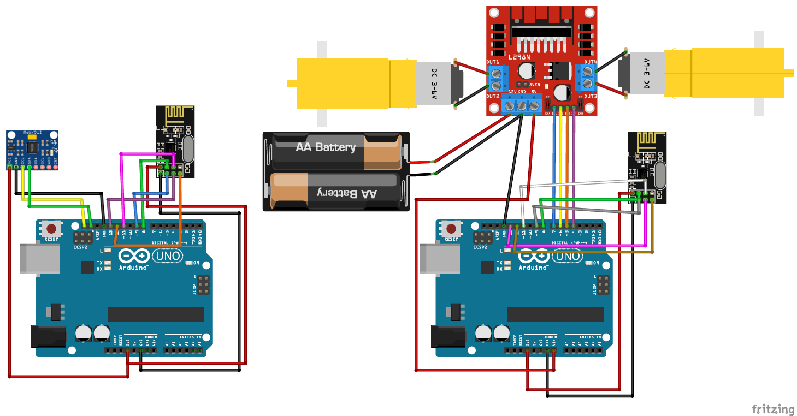

# Wireless Accelerometer Robot

This project enables control of a car using an MPU6050 accelerometer and the nRF24L01 wireless module for communication between a master and slave Arduino.

## Overview

The project consists of two Arduino sketches:
- **Master Code**: Reads orientation data from the MPU6050 and sends control signals wirelessly to the slave Arduino.
- **Slave Code**: Receives control signals from the master Arduino via the nRF24L01 module and controls the motors of the car accordingly.

## Components Used

- Arduino Uno (for both master and slave)
- MPU6050 accelerometer module
- nRF24L01 wireless transceiver module
- Motor driver module (L298N or similar)
- DC motors and wheels
- Power supply (depending on motor voltage requirements)

## Installation

### Hardware Setup

1. **Master Arduino Setup**:
   - Connect the MPU6050 to the Arduino via I2C.
   - Connect the nRF24L01 module to the Arduino SPI pins (CE, CSN, SCK, MOSI, MISO).
   - Ensure proper power supply to both modules.

2. **Slave Arduino Setup**:
   - Connect the nRF24L01 module to the Arduino SPI pins (CE, CSN, SCK, MOSI, MISO).
   - Connect the motor driver inputs (IN1, IN2, IN3, IN4) to the Arduino digital pins as per the slave code.

### Software Setup

1. **Install Libraries**:
   - Ensure you have installed the following libraries:
     - MPU6050 library (for accelerometer communication)
     - RF24 library (for nRF24L01 communication)

2. **Upload Code**:
   - Upload the **Master Code** to the master Arduino.
   - Upload the **Slave Code** to the slave Arduino.

## Usage

1. Power up both Arduino boards.
2. The MPU6050 on the master Arduino reads orientation data (pitch and roll).
3. Based on the orientation:
   - Forward ('F'): Pitch > 20 degrees
   - Backward ('B'): Pitch < -20 degrees
   - Right ('R'): Roll > 20 degrees
   - Left ('L'): Roll < -20 degrees
   - Stop ('S'): When no significant tilt is detected.
4. The master Arduino sends these commands wirelessly to the slave Arduino.
5. The slave Arduino receives commands and controls the motors accordingly.

## Circuit

